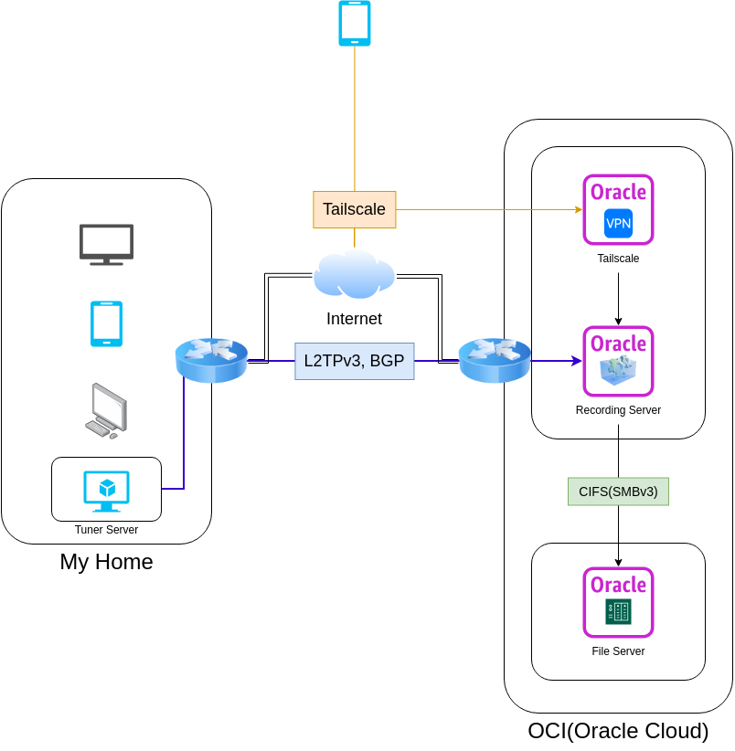

# mirakurun(softcas)+epgstaion on docker

使う場合は自己責任で使う。

## command

Mirakurunは家にチューナーがある関係で家で、それ以外はクラウドにて実行する。

### mirakurun node
```shell
$ docker login
$ git submodule init
Submodule 'mirakurun/softcas' (https://github.com/miutaku/softcas) registered for path 'mirakurun/softcas'
$ docker compose -f docker-compose-mirakurun.yml up
```

### OCI instance
```shell
$ docker compose -f docker-compose-epgstation.yml up
```

# アーキテクチャ



# Qiita

[[ドケチ話] 無料で200GBのNASをクラウドで手に入れた](https://qiita.com/Miutaku/items/ef8dda7516cf9ecce83a)
